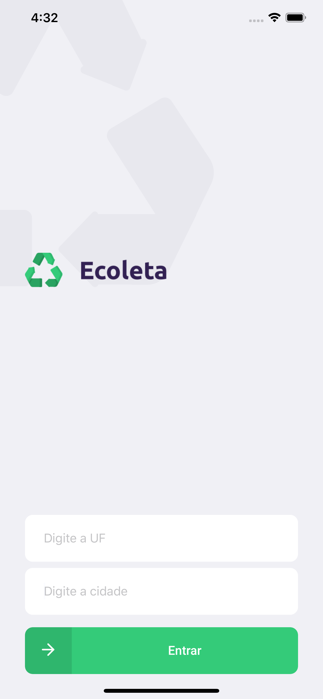
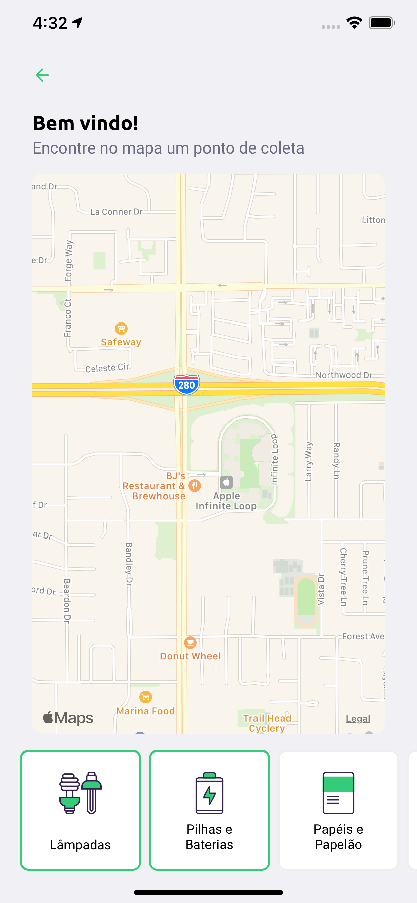

# 4º Dia: Mobile do App

* Instalar Expo CLI
* Criar projeto com Expo
* Executando projeto
* Configurando emulador
* Diferenças do React Native para ReactJS
*  Criando página home
*  Configurar navegação
*  Criando página do mapa
*  Criando página do detalhe
*  Buscando itens da API
*  Buscando pontos da API
*  Buscando detalhes do ponto da API
*  Busca de UF e Cidade

<h2>Página inicial</h2>

<h2>Página de localização</h2>

