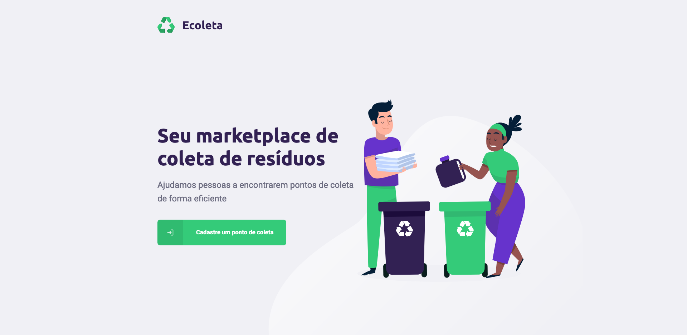
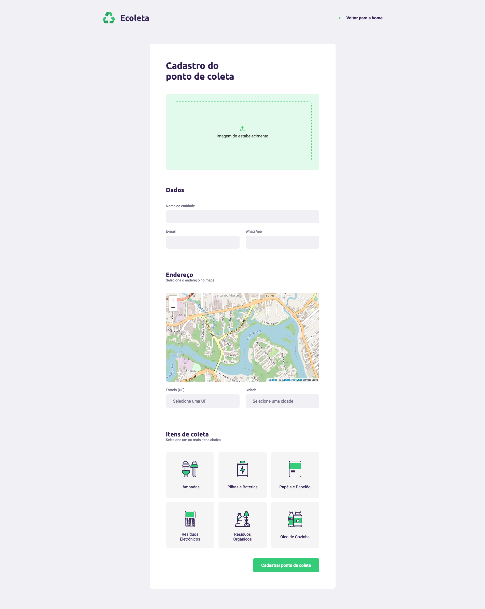

# 3º Dia: Front-end web do app

* Limpando Estrutura da aplicação

*  Explicando conceitos
    1. index.html e div#root
    2. JSX 
    3. Componente (Header)
    4. Propriedade
    5. Estado e imutabilidade

* Construção do HTML da primeira página
* Configuração da navegação
* Construção do HTML do formulário
* Integrando mapa no formulário
* Buscando itens de coleta da API
* Buscando estados e cidades do IBGE
* Opção pro usuário selecionar uma localidade no mapa
* Carregar a localização atual do usuário no mapa
* Cadastro de ponto de coleta na API

<h2>Página inicial</h2>

<h2>Página de cadastro</h2>

